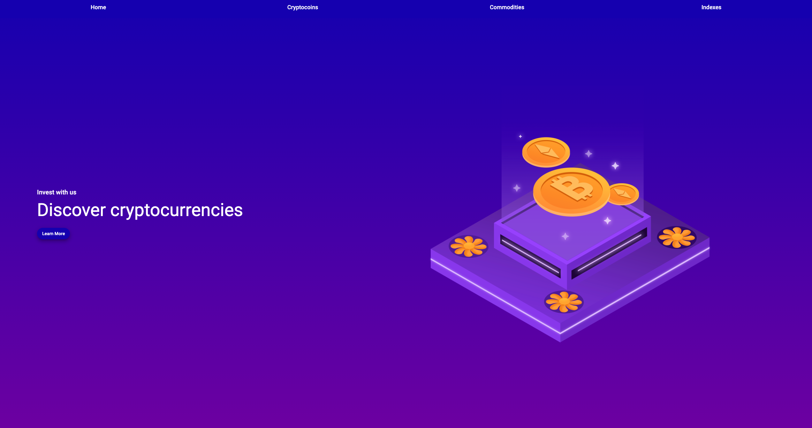
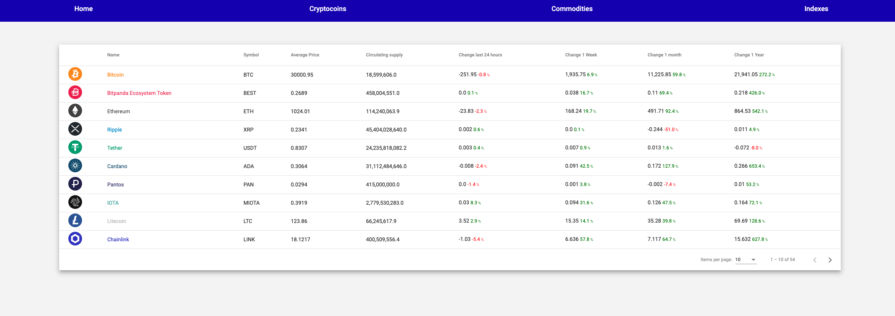

# BitpandaCode

Angular Project using the https://api.bitpanda.com/v1/masterdata end-point for Bitpanda code interview.

### To run the project

`ng build --prod` will create the dist repository
Then install any local server like Apache or other, I used `npm install http-server`
In the terminal, `cd ~/pathToProject` and `http-server dist/bitpanda-code`

The local server is now running, you can go to `http://localhost:8080` to view the application.

### Home screen

Landing page that contains a table and few paragraphs.

### Tables

Using the data from the Bitpanda endpoint, there is no interraction, just for display.

